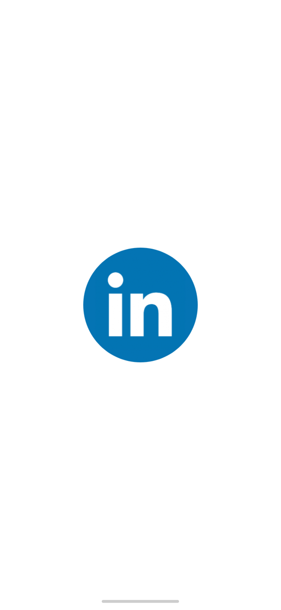
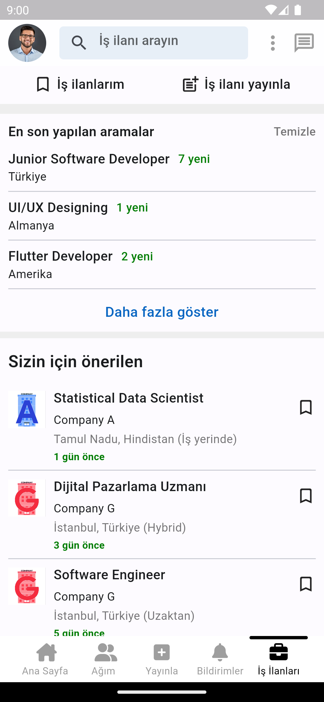

# LinkedIn Mobile App UI
Bu proje, Dart dilinde Flutter ile geliştirilmiş LinkedIn Mobil Uygulaması klonunun frontend'ini içerir. Uygulama, LinkedIn'in temel işlevlerini taklit eden bir arayüze sahiptir. Backend kısmı olmadan, kullanıcılar BottomNavigationBar’daki sekme sayfaları arasında geçiş yapabilirler.

## Uygulama Ekran Görüntüleri

<table>
  <tr>
    <td>1</td>
     <td>2</td>
     <td>3</td>  
  <tr>
    <td></td>
    <td></td>
    <td></td>   
 </table>

<table>
  <tr>
    <td>4</td>
     <td>5</td>
     <td>6</td> 
  <tr>
    <td></td>
    <td></td>
    <td></td>
 </table>

## Lisans
Bu proje MIT lisansı altında lisanslanmıştır - Daha fazla bilgi için [LICENSE](LICENSE) dosyasına bakın.

---

## İletişim
Eğer herhangi bir sorunuz, öneriniz veya geri bildiriminiz varsa, bana aşağıdaki kanallardan ulaşabilirsiniz:
- LinkedIn: [LinkedIn Profilim](https://www.linkedin.com/in/hsynkbulut/)
- Medium: [Medium Profilim](https://medium.com/@hsynkbulut)
- E-posta: [E-mail adresim](mailto:hsyn.kbulut@gmail.com)